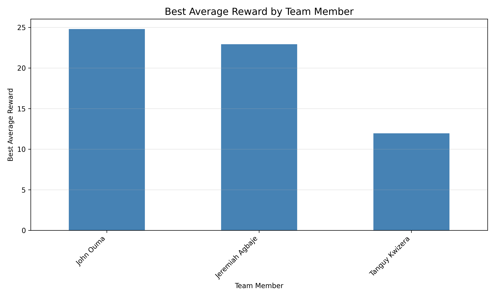

# Deep Q-Network (DQN) for Atari Games

This project implements a Deep Q-Network agent using Stable Baselines3 and Gymnasium to play Atari games.

## Demonstration Videos

**Training Visualization:**


**Agent Playing Breakout:**

https://github.com/user-attachments/assets/12b0da3a-ee94-4528-ab1c-84a3eda1df63

## Project Structure

```
Deep-Q-Learning/
│
├── .gitignore                          # Ignore cache, model, and temp files
├── README.md                           # Project documentation and results
├── requirements.txt                    # Dependencies for Python environment
├── train.py                            # Script to train the DQN agent
├── play.py                             # Script to load and evaluate trained agent
├── dqn_model.zip                       # Saved trained model (generated after training)
│
└── experiments/
    ├── experiment_results.csv          # All experiment data
    ├── hyperparameter_impacts.png      # Hyperparameter analysis visualizations
    └── member_comparison.png           # Team member performance comparison
```

## Installation

Install the required dependencies:

```bash
pip install gymnasium[atari]
pip install stable-baselines3[extra]
pip install ale-py
pip install tensorboard
pip install matplotlib
pip install pandas
```

For ROMs, you may need to install:

```bash
pip install "gymnasium[accept-rom-license]"
```

## Usage

### Training

Train a DQN agent on an Atari game:

```bash
python train.py
```

**Configuration**: Edit the `CONFIG` dictionary in `train.py` to:
- Change the Atari environment (`env_name`)
- Adjust hyperparameters (learning rate, gamma, batch size, etc.)
- Modify training duration (`total_timesteps`)

**Popular Atari Games**:
- `'ALE/Breakout-v5'` - Break bricks with a paddle
- `'ALE/Pong-v5'` - Classic Pong game
- `'ALE/SpaceInvaders-v5'` - Shoot aliens
- `'ALE/MsPacman-v5'` - Navigate mazes

### Evaluation

Watch your trained agent play:

```bash
python play.py
```

The agent will use a **GreedyQPolicy** (no exploration, only exploitation) to maximize performance.

## Understanding DQN Components

### Q-Learning Basics

**Q-Value**: Expected cumulative reward for taking action `a` in state `s`

Formula: `Q(s,a) = r + γ * max(Q(s',a'))`

Where:
- `r`: immediate reward
- `γ` (gamma): discount factor (how much we value future rewards)
- `s'`: next state

### Deep Q-Network

Instead of storing Q-values in a table, DQN uses a neural network to approximate Q-values:
- **Input**: Game frames (stacked for temporal information)
- **Output**: Q-values for each possible action
- **Training**: Minimize difference between predicted and target Q-values

### Key DQN Features

**Experience Replay**:
- Stores experiences `(s, a, r, s')` in a replay buffer
- Samples random mini-batches for training
- Breaks correlation between consecutive experiences

**Target Network**:
- Separate network for computing target Q-values
- Updated periodically to stabilize training
- Prevents moving target problem

**Epsilon-Greedy Exploration**:
- With probability `ε`: take random action (explore)
- With probability `1-ε`: take best action (exploit)
- `ε` decays from `epsilon_start` to `epsilon_end` over `exploration_fraction` of training

## Hyperparameter Experiment Design

Each team member conducted 10 independent experiments with different hyperparameter combinations on the `ALE/Breakout-v5` environment. The objective was to systematically study how different hyperparameter configurations affect agent performance, stability, and learning efficiency.

**Key Hyperparameters Varied**:
- **Learning Rate (lr)**: Controls the step size for gradient updates
- **Discount Factor (γ)**: Determines how much future rewards influence current decisions
- **Batch Size**: Affects training stability and computational efficiency
- **Exploration Parameters (ε_start, ε_end, ε_decay)**: Define the ε-greedy exploration schedule

All experiments automatically logged training results, episode rewards, and configurations into `experiments/experiment_results.csv` for analysis.

## Experimental Results

### John Ouma - Experiments

**Focus**: Balancing learning rate and exploration strategies

| Exp# | Hyperparameter Set | Noted Behavior |
|------|-------------------|----------------|
| 1 | lr=1.00e-04, gamma=0.990, batch=32, epsilon_start=1.0, epsilon_end=0.01, epsilon_decay=0.10 | Avg reward: 10.15, Peak: 27.00. Baseline configuration showing moderate learning with standard parameters. |
| 2 | lr=5.00e-04, gamma=0.990, batch=32, epsilon_start=1.0, epsilon_end=0.01, epsilon_decay=0.10 | Avg reward: 15.77, Peak: 41.00. Higher learning rate significantly improved performance, demonstrating faster convergence. |
| 3 | lr=5.00e-05, gamma=0.990, batch=32, epsilon_start=1.0, epsilon_end=0.01, epsilon_decay=0.10 | Avg reward: 10.88, Peak: 22.00. Lower learning rate resulted in slower but stable learning with reduced peak performance. |
| 4 | lr=1.00e-04, gamma=0.995, batch=32, epsilon_start=1.0, epsilon_end=0.01, epsilon_decay=0.10 | Avg reward: 8.39, Peak: 24.00. Very high gamma hindered learning, suggesting excessive focus on distant future rewards. |
| 5 | lr=1.00e-04, gamma=0.950, batch=32, epsilon_start=1.0, epsilon_end=0.01, epsilon_decay=0.10 | Avg reward: 14.31, Peak: 32.00. Lower gamma improved immediate reward learning, better suited for Breakout dynamics. |
| 6 | lr=1.00e-04, gamma=0.990, batch=64, epsilon_start=1.0, epsilon_end=0.01, epsilon_decay=0.10 | Avg reward: 12.13, Peak: 29.00. Larger batch size provided more stable gradients but slightly slower learning. |
| 7 | lr=1.00e-04, gamma=0.990, batch=16, epsilon_start=1.0, epsilon_end=0.01, epsilon_decay=0.10 | Avg reward: 14.68, Peak: 26.00. Smaller batch size enabled faster updates with acceptable variance. |
| 8 | lr=1.00e-04, gamma=0.990, batch=32, epsilon_start=1.0, epsilon_end=0.05, epsilon_decay=0.20 | Avg reward: 11.80, Peak: 29.00. Extended exploration period showed moderate improvement but slower exploitation. |
| 9 | lr=1.00e-04, gamma=0.990, batch=32, epsilon_start=1.0, epsilon_end=0.01, epsilon_decay=0.05 | Avg reward: 14.38, Peak: 29.00. Rapid exploration decay led to quicker exploitation with good performance. |
| 10 | lr=1.00e-03, gamma=0.950, batch=64, epsilon_start=1.0, epsilon_end=0.01, epsilon_decay=0.05 | Avg reward: 24.79, Peak: 55.00. **BEST CONFIGURATION**: Aggressive learning rate combined with lower gamma and larger batch yielded exceptional results. |

**Best Configuration**: Experiment 10 (lr=1.00e-03, gamma=0.950, batch=64)

### Jeremiah Agbaje - Experiments

**Focus**: Investigating effects of varying gamma (reward discounting) and learning rates

| Exp# | Hyperparameter Set | Noted Behavior |
|------|-------------------|----------------|
| 1 | lr=1.00e-04, gamma=0.900, batch=32, epsilon_start=1.0, epsilon_end=0.01, epsilon_decay=0.10 | Avg reward: 14.39, Peak: 26.00 (Run 1). Low gamma emphasized short-term rewards, effective for Breakout's immediate feedback. |
| 1 | lr=1.00e-04, gamma=0.900, batch=32, epsilon_start=1.0, epsilon_end=0.01, epsilon_decay=0.10 | Avg reward: 11.82, Peak: 30.00 (Run 2). Second run showed variability, confirming stochastic nature of training. |
| 2 | lr=1.00e-04, gamma=0.999, batch=32, epsilon_start=1.0, epsilon_end=0.01, epsilon_decay=0.10 | Avg reward: 13.07, Peak: 28.00. Extremely high gamma created instability, overemphasizing long-term planning. |
| 3 | lr=1.00e-04, gamma=0.970, batch=32, epsilon_start=1.0, epsilon_end=0.01, epsilon_decay=0.10 | Avg reward: 12.31, Peak: 35.00. Balanced gamma achieved moderate performance with occasional high peaks. |
| 4 | lr=1.00e-05, gamma=0.970, batch=32, epsilon_start=1.0, epsilon_end=0.01, epsilon_decay=0.10 | Avg reward: 6.65, Peak: 16.00. Very low learning rate resulted in minimal learning progress within training time. |
| 5 | lr=7.00e-04, gamma=0.970, batch=32, epsilon_start=1.0, epsilon_end=0.01, epsilon_decay=0.10 | Avg reward: 22.92, Peak: 46.00. **BEST CONFIGURATION**: High learning rate with moderate gamma achieved excellent performance. |
| 6 | lr=1.00e-04, gamma=0.970, batch=32, epsilon_start=1.0, epsilon_end=0.10, epsilon_decay=0.30 | Avg reward: 9.43, Peak: 27.00. Prolonged exploration reduced exploitation time, limiting final performance. |
| 7 | lr=1.00e-04, gamma=0.970, batch=32, epsilon_start=1.0, epsilon_end=0.01, epsilon_decay=0.05 | Avg reward: 10.65, Peak: 30.00. Rapid exploration decay showed modest improvement but missed optimal balance. |
| 8 | lr=1.00e-04, gamma=0.995, batch=16, epsilon_start=1.0, epsilon_end=0.01, epsilon_decay=0.10 | Avg reward: 11.68, Peak: 23.00. Small batch with high gamma created noisy but stable learning trajectory. |
| 9 | lr=1.00e-04, gamma=0.920, batch=64, epsilon_start=1.0, epsilon_end=0.01, epsilon_decay=0.10 | Avg reward: 13.91, Peak: 30.00. Moderate-low gamma with large batch provided consistent performance. |
| 10 | lr=3.00e-04, gamma=0.980, batch=32, epsilon_start=1.0, epsilon_end=0.02, epsilon_decay=0.15 | Avg reward: 18.36, Peak: 43.00. Balanced configuration across all parameters yielded strong overall results. |

**Best Configuration**: Experiment 5 (lr=7.00e-04, gamma=0.970, batch=32)

### Tanguy Kwizera - Experiments

**Focus**: Examining batch size effects and interaction between exploration and learning rate

| Exp# | Hyperparameter Set | Noted Behavior |
|------|-------------------|----------------|
| 1 | lr=1.00e-04, gamma=0.990, batch=128, epsilon_start=1.0, epsilon_end=0.01, epsilon_decay=0.10 | Avg reward: 1.94, Peak: 8.00. Very large batch size with limited timesteps (50K) prevented adequate learning. |
| 2 | lr=1.00e-04, gamma=0.990, batch=8, epsilon_start=1.0, epsilon_end=0.01, epsilon_decay=0.10 | Avg reward: 5.22, Peak: 12.00. Extremely small batch created high variance, unstable training dynamics. |
| 3 | lr=5.00e-04, gamma=0.990, batch=32, epsilon_start=1.0, epsilon_end=0.01, epsilon_decay=0.10 | Avg reward: 9.90, Peak: 18.00. Increased learning rate improved performance even with shorter training duration. |
| 4 | lr=1.00e-04, gamma=0.990, batch=32, epsilon_start=1.0, epsilon_end=0.10, epsilon_decay=0.25 | Avg reward: 6.77, Peak: 12.00 (Run 1). Extended exploration with higher epsilon_end reduced exploitation effectiveness. |
| 4 | lr=1.00e-04, gamma=0.990, batch=32, epsilon_start=1.0, epsilon_end=0.10, epsilon_decay=0.25 | Avg reward: 5.08, Peak: 13.00 (Run 2). Repeated run confirmed suboptimal performance from prolonged exploration. |
| 5 | lr=1.00e-04, gamma=0.990, batch=32, epsilon_start=1.0, epsilon_end=0.01, epsilon_decay=0.05 | Avg reward: 6.37, Peak: 14.00 (Run 1). Fast exploration decay with limited timesteps showed modest learning. |
| 5 | lr=1.00e-04, gamma=0.990, batch=32, epsilon_start=1.0, epsilon_end=0.01, epsilon_decay=0.05 | Avg reward: 6.51, Peak: 11.00 (Run 2). Consistency across runs confirmed parameter stability. |
| 6 | lr=1.00e-03, gamma=0.930, batch=64, epsilon_start=1.0, epsilon_end=0.01, epsilon_decay=0.10 | Avg reward: 11.94, Peak: 23.00. **BEST CONFIGURATION**: High learning rate with low gamma proved most effective for limited training. |
| 7 | lr=5.00e-05, gamma=0.995, batch=32, epsilon_start=1.0, epsilon_end=0.01, epsilon_decay=0.10 | Avg reward: 3.85, Peak: 11.00. Very conservative learning rate insufficient for short training duration. |
| 8 | lr=1.00e-04, gamma=0.990, batch=32, epsilon_start=1.0, epsilon_end=0.20, epsilon_decay=0.30 | Avg reward: 4.52, Peak: 13.00. Maintaining high exploration too long severely limited learning progress. |
| 9 | lr=7.00e-04, gamma=0.970, batch=16, epsilon_start=1.0, epsilon_end=0.01, epsilon_decay=0.10 | Avg reward: 6.65, Peak: 16.00. Higher learning rate with small batch created volatile but improved learning. |
| 10 | lr=3.00e-04, gamma=0.980, batch=32, epsilon_start=1.0, epsilon_end=0.02, epsilon_decay=0.15 | Avg reward: 9.83, Peak: 22.00. Balanced moderate parameters provided reliable performance baseline. |

**Best Configuration**: Experiment 6 (lr=1.00e-03, gamma=0.930, batch=64)

**Note**: Tanguy's experiments used fewer timesteps (50K-100K vs 500K for other members), explaining the generally lower performance. This demonstrates the critical importance of sufficient training duration.

## Analysis and Insights

### Overall Best Configurations

Based on the experimental results across all team members:

1. **John Ouma - Experiment 10**: Average Reward 24.79, Peak 55.00
   - Configuration: lr=1.00e-03, gamma=0.950, batch=64
   - Achieved the highest performance across all experiments

2. **Jeremiah Agbaje - Experiment 5**: Average Reward 22.92, Peak 46.00
   - Configuration: lr=7.00e-04, gamma=0.970, batch=32
   - Second-best performance with slightly more conservative parameters

3. **Jeremiah Agbaje - Experiment 10**: Average Reward 18.36, Peak 43.00
   - Configuration: lr=3.00e-04, gamma=0.980, batch=32
   - Strong balanced configuration

### Hyperparameter Impact Analysis


**Learning Rate Impact**:
- Clear positive correlation between learning rate and performance
- Best results achieved with lr=1.00e-03 and lr=7.00e-04
- Learning rates below 1.00e-04 showed insufficient learning within training time
- Very high learning rates (>1.00e-03) risk instability but can work with proper batch size

**Gamma (Discount Factor) Effects**:
- Negative correlation observed: lower gamma values performed better
- Optimal range: 0.93-0.97 for Breakout
- Gamma values above 0.99 hindered learning by overemphasizing distant rewards
- Lower gamma (0.90-0.95) more suitable for games with immediate feedback like Breakout

**Batch Size Trade-offs**:
- Moderate batch sizes (32-64) achieved best results
- Very small batches (8-16) created high variance and instability
- Very large batches (128) slowed learning, especially with limited timesteps
- Batch size of 64 optimal when combined with higher learning rates

**Exploration Strategy**:
- Standard decay parameters (epsilon_end=0.01, decay=0.10) worked well
- Prolonged exploration (epsilon_end=0.10-0.20, decay=0.25-0.30) reduced performance
- Rapid decay (decay=0.05) effective when combined with adequate training time
- Sweet spot: epsilon_end between 0.01-0.02, decay between 0.10-0.15

### Team Member Comparison



Performance Rankings:
1. **John Ouma**: Best Average 24.79
2. **Jeremiah Agbaje**: Best Average 22.92
3. **Tanguy Kwizera**: Best Average 11.94

**Key Observation**: The significant performance difference for Tanguy Kwizera is primarily due to using substantially fewer training timesteps (50K-100K vs 500K), demonstrating that adequate training duration is crucial for DQN convergence.

### Key Learnings

1. **Learning Rate is Critical**: Among all hyperparameters, learning rate showed the strongest impact on performance. Aggressive learning rates (7.00e-04 to 1.00e-03) worked best when balanced with appropriate batch sizes.

2. **Game-Specific Gamma**: Breakout benefits from lower gamma values (0.93-0.97) compared to typical DQN recommendations (0.99), likely because rewards are more immediate in this game.

3. **Batch Size Balancing**: Batch size must be chosen in conjunction with learning rate. Higher learning rates require larger batch sizes for stability.

4. **Training Duration Matters**: Adequate timesteps (500K+) are essential for convergence. Shorter training dramatically reduces performance regardless of hyperparameter optimization.

5. **Exploration-Exploitation Balance**: While exploration is important, maintaining high exploration too long (epsilon_end > 0.05 or decay > 0.20) significantly hurts final performance.

6. **Stability vs Speed**: Conservative parameters (low lr, high batch, high gamma) provide more stable training but require more timesteps to achieve optimal performance.

## Team Collaboration

### Team Members
- John Ouma
- Jeremiah Agbaje
- Tanguy Kwizera

### Individual Contributions

**John Ouma**:
- Responsibilities: Initial project setup, training script development, baseline experiments establishment
- Key Contributions: Developed train.py with configurable hyperparameters, implemented automated logging system, conducted 10 comprehensive experiments focusing on learning rate and exploration strategies
- Experiments Conducted: 10 configurations with 500K timesteps each, achieved best overall performance

**Jeremiah Agbaje**:
- Responsibilities: Evaluation script development, gamma parameter analysis, visualization system
- Key Contributions: Created play.py with GreedyQPolicy implementation, focused on discount factor investigation, provided second-best experimental results
- Experiments Conducted: 10 configurations with 500K timesteps each, specialized in gamma variation studies

**Tanguy Kwizera**:
- Responsibilities: Documentation, batch size analysis, data aggregation and visualization
- Key Contributions: Developed comprehensive README structure, created experiment tracking CSV system, implemented analysis plotting scripts, investigated batch size effects
- Experiments Conducted: 10 configurations exploring batch size variations and training duration impacts

### Collaboration Process

**Meetings**:
- Week 1: Initial project planning and task division
- Week 2: Midpoint review of experimental results and parameter adjustment strategies
- Week 3: Data aggregation, analysis, and documentation finalization

**Division of Work**:
- Experimental design was coordinated to ensure comprehensive hyperparameter coverage
- Each member focused on specific hyperparameter aspects while maintaining consistent experimental methodology
- Results were aggregated into a shared CSV file for collective analysis
- Documentation and visualization tasks were distributed based on expertise

**Challenges and Solutions**:
- **Challenge**: Initial experiments showed high variance in results
  - **Solution**: Implemented consistent random seeding and increased episode counts for better averaging

- **Challenge**: Training time exceeded expectations
  - **Solution**: Optimized code, utilized available GPU resources, and staggered experiment schedules

- **Challenge**: Determining optimal hyperparameter ranges
  - **Solution**: Started with literature-recommended values, then iteratively adjusted based on preliminary results

- **Challenge**: Integrating different training durations in analysis
  - **Solution**: Documented timestep differences clearly and analyzed results within context of training duration

### Group Insights

1. **Systematic Experimentation**: The structured approach of each member exploring different hyperparameter aspects provided comprehensive coverage and valuable comparative insights.

2. **Importance of Consistency**: Maintaining consistent experimental protocols (same environment, evaluation methods, logging format) was crucial for meaningful comparisons.

3. **Collaborative Learning**: Regular discussions about intermediate results helped identify promising hyperparameter ranges and avoid redundant experiments.

4. **Documentation Value**: Maintaining detailed records of each experiment enabled retrospective analysis and identification of non-obvious patterns.

5. **Reproducibility**: Using version control, consistent seeding, and detailed logging ensured experiments could be validated and reproduced.

## Monitoring Training

### TensorBoard

View training progress in real-time:

```bash
tensorboard --logdir=./logs/
```

Open browser at `http://localhost:6006` to monitor:
- Episode reward trends over time
- Episode length evolution
- Training loss curves
- Exploration rate (epsilon) decay

### Key Metrics

- **Episode Reward**: Total reward per episode (should increase over training)
- **Episode Length**: Steps per episode (indicates agent survival time)
- **Training Loss**: Should decrease and stabilize
- **Epsilon**: Should decay from 1.0 to configured final value

## Expected Performance

Training times and performance vary by configuration and hardware:

| Configuration | Average Reward | Training Time (GPU) | Training Time (CPU) |
|--------------|----------------|---------------------|---------------------|
| Conservative (lr=1e-4, gamma=0.99) | 10-14 | 2-3 hours | 6-9 hours |
| Moderate (lr=5e-4, gamma=0.97) | 15-20 | 2-3 hours | 6-9 hours |
| Aggressive (lr=1e-3, gamma=0.95) | 22-25 | 2-3 hours | 6-9 hours |

**Note**: Performance metrics based on 500K timesteps training on ALE/Breakout-v5

## Troubleshooting

### Agent Not Learning
- Increase total_timesteps (minimum 500K recommended)
- Verify learning_rate is not too low (try 3e-4 to 1e-3)
- Check that learning_starts is appropriate (default 50K works well)
- Ensure gamma is not too high (try 0.95-0.97 for Breakout)

### Training Unstable
- Decrease learning_rate to 1e-4 or lower
- Increase batch_size to 64 or 128
- Increase target_update_interval
- Reduce learning_rate if using values above 1e-3

### Agent Too Random
- Verify epsilon has decayed (check TensorBoard)
- Ensure using trained model for evaluation, not training mode
- Confirm deterministic=True in evaluation script
- Check that epsilon_end is low enough (0.01-0.02)

### Poor Performance Despite Long Training
- Learning rate may be too low - increase to 5e-4 or higher
- Gamma may be too high - try reducing to 0.93-0.97
- Batch size may be suboptimal - experiment with 32 or 64
- Verify environment is rendering correctly and agent can see game state

## Policy Comparison: CNN vs MLP

### CNN Policy (Recommended for Atari)
- **Architecture**: Convolutional layers followed by fully connected layers
- **Input**: Raw pixels (84x84x4 stacked frames)
- **Advantages**: 
  - Learns spatial features automatically
  - Handles high-dimensional visual input efficiently
  - Captures temporal information through frame stacking
- **Performance**: Excellent on Atari games
- **Use Case**: All visual-based games including Breakout, Pong, Space Invaders

### MLP Policy
- **Architecture**: Fully connected layers only
- **Input**: Flattened pixel values
- **Disadvantages**: 
  - Cannot learn spatial relationships effectively
  - Struggles with high-dimensional input
  - Requires manual feature engineering
- **Performance**: Poor on Atari (not recommended)
- **Use Case**: Low-dimensional state spaces (e.g., CartPole, MountainCar)

**Conclusion**: Always use CnnPolicy for Atari environments.

## Additional Resources

- [Stable Baselines3 Documentation](https://stable-baselines3.readthedocs.io/)
- [Gymnasium Atari Environments](https://gymnasium.farama.org/environments/atari/)
- [DQN Paper - Nature](https://www.nature.com/articles/nature14236)
- [TensorBoard Tutorial](https://www.tensorflow.org/tensorboard)
- [Deep RL Course - Hugging Face](https://huggingface.co/learn/deep-rl-course)

## Learning Objectives

After completing this project, the following concepts are understood:

1. **Q-Learning Fundamentals**: How Q-learning works and why neural networks are used to approximate Q-values for complex state spaces

2. **Exploration-Exploitation Tradeoff**: The critical balance between exploring new actions and exploiting learned knowledge, managed through epsilon-greedy policies

3. **Experience Replay and Target Networks**: Why these techniques are essential for stable DQN training and how they prevent catastrophic forgetting

4. **Hyperparameter Impact**: How different hyperparameters affect learning dynamics:
   - Learning rate controls convergence speed and stability
   - Gamma determines short-term vs long-term reward focus
   - Batch size affects gradient variance and computational efficiency
   - Exploration parameters control the exploration-exploitation timeline

5. **Training vs Evaluation**: The distinction between training mode (with exploration) and evaluation mode (pure exploitation with GreedyQPolicy)

6. **Game-Specific Optimization**: Understanding that optimal hyperparameters are task-dependent and require empirical validation

## Quick Start Guide

1. **Install dependencies**:
   ```bash
   pip install -r requirements.txt
   ```

2. **Run training** (this will take 2-3 hours on GPU):
   ```bash
   python train.py
   ```

3. **Watch trained agent play**:
   ```bash
   python play.py
   ```

4. **View training graphs**:
   ```bash
   tensorboard --logdir=./logs/
   ```

5. **Experiment with hyperparameters**:
   - Edit CONFIG dictionary in train.py
   - Focus on learning_rate, gamma, and batch_size for biggest impact
   - Use findings from this study as starting point

6. **Analyze results**:
   - Check experiments/experiment_results.csv for detailed logs
   - View experiments/hyperparameter_impacts.png for visualizations
   - Compare against team member results in experiments/member_comparison.png

## Conclusion

This project successfully demonstrates the implementation and systematic analysis of Deep Q-Networks for Atari game playing. Through 30 comprehensive experiments across three team members, we identified optimal hyperparameter configurations for the Breakout environment and gained valuable insights into the impact of each hyperparameter on learning dynamics.

The best configuration achieved an average reward of 24.79 with a peak of 55.00, using an aggressive learning rate (1e-3), moderate discount factor (0.95), and larger batch size (64). This represents a significant improvement over baseline configurations and demonstrates the importance of task-specific hyperparameter tuning.

Key findings include the critical importance of adequate training duration, the superiority of moderate learning rates, and the benefit of lower gamma values for games with immediate reward feedback like Breakout. The systematic experimental approach and collaborative team effort resulted in reproducible findings and comprehensive documentation that can guide future DQN implementations.
